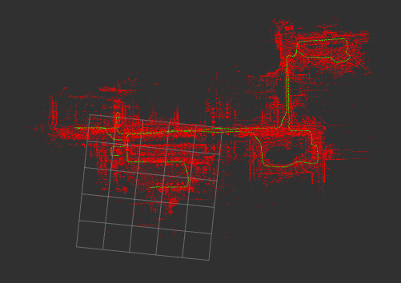

<div align="center">

<h1>lidar_localization_ros2</h1>

<p><strong>Map-based 3D LiDAR localization for ROS 2 and Nav2.</strong></p>

<p>
  <a href="https://github.com/rsasaki0109/lidar_localization_ros2/actions/workflows/main.yml">
    
  </a>
  
  
  
</p>



<p><a href="./docs/koide_gif_gallery.md">Explore the complete Koide indoor/outdoor GIF gallery →</a></p>

</div>

## Features

- NDT/GICP localization against `.pcd` and `.ply` maps
- standalone, Nav2, and Livox MID-360 launch configurations
- odometry/IMU prediction, scan deskew, diagnostics, and guarded recovery
- rosbag demo and regression tools

ROS 2 Jazzy with NDT_OMP is the recommended starting point. Continuous-time deskew is
enabled by default and safely leaves scans unchanged until point timing and motion data
are ready. Guarded global initialization is enabled automatically when quickstart is
given a matching occupancy map. See [v1 status](docs/v1_status.md) for validated scope
and limitations.

## Install

```bash
mkdir -p ~/lidarloc_ws/src
cd ~/lidarloc_ws/src
git clone https://github.com/rsasaki0109/lidar_localization_ros2.git
cd lidar_localization_ros2
scripts/bootstrap_colcon_workspace.sh --build
source ~/lidarloc_ws/install/setup.bash
```

For manual builds and no-sudo setup, see [local build](docs/local_build.md).

## Quick Start

Start localization and RViz with one command:

```bash
ros2 run lidar_localization_ros2 quickstart.py \
  --profile standalone \
  --map /absolute/path/to/map.pcd
```

Quickstart detects unambiguous sensor topics, generates a reusable configuration,
restores only a pose saved against the same map, and verifies tracking. Add the matching
occupancy map or a mapping-run reference CSV for guarded global initialization with
3D NDT scoring:

```bash
ros2 run lidar_localization_ros2 quickstart.py \
  --profile mid360 \
  --map /absolute/path/to/map.pcd \
  --occupancy-map /absolute/path/to/map.yaml
```

Known routes (avoids map-wide BBS corridor aliases):

```bash
ros2 run lidar_localization_ros2 quickstart.py \
  --profile mid360 \
  --map /absolute/path/to/map.pcd \
  --reference-csv /absolute/path/to/mapping_run/reference.csv
```

If no safe candidate is available, it asks for **2D Pose Estimate** in RViz; it never
guesses the origin. See [quickstart and automatic initialization](docs/quickstart.md)
and the [repeat-route site setup](docs/site_setup.md) guide.
Use `--no-auto-initialize` to disable saved-pose restoration and global initialization,
or launch with `use_continuous_time_deskew:=false` to disable deskew.

Common launches:

```bash
# Standalone localization
ros2 launch lidar_localization_ros2 nav2_lidar_localization.launch.py

# Nav2
ros2 launch lidar_localization_ros2 nav2_navigation.launch.py \
  map_yaml:=/absolute/path/to/map.yaml

# Livox MID-360
ros2 launch lidar_localization_ros2 mid360_legged_localization.launch.py \
  map_path:=/absolute/path/to/map.pcd \
  cloud_topic:=/livox/points imu_topic:=/livox/imu
```

Check topics, TF, pose output, and diagnostics with:

```bash
ros2 run lidar_localization_ros2 check_lidar_localization_bringup.py \
  --profile standalone
```

## Runtime Contract

The default frames are `map`, `odom`, and `base_link`.

- `/initialpose` is expressed in `map`.
- Standalone mode publishes `map -> base_link`.
- Nav2 mode publishes `map -> odom` and requires an external `odom -> base_link`.
- `use_odom: true` consumes `/odom`; it does not publish odometry TF.
- Static LiDAR and IMU transforms must have only one publisher.

Main inputs are `/cloud`, `/initialpose`, `/odom`, and `/imu`. Main outputs are
`/pcl_pose`, `/path`, `/alignment_status`, and `/reinitialization_requested`. All
topic names are configurable. See [frame contract](docs/frame_contract.md) and
[troubleshooting](docs/troubleshooting.md) for details.

Nav2 additionally requires a 2D occupancy map and an `odom -> base_link` source.

## Public Demo

The Autoware Istanbul demo downloads its public assets, builds when needed, replays
60 seconds, and writes a trajectory report:

```bash
source scripts/setup_local_env.sh
scripts/run_public_demo.sh
```

First-time setup may take 15–30 minutes. For datasets, metrics, and regression
commands, see [benchmarking](docs/benchmarking.md).

## Documentation

- [Validated scope](docs/v1_status.md)
- [Frames](docs/frame_contract.md) and [troubleshooting](docs/troubleshooting.md)
- [Benchmarking](docs/benchmarking.md)
- [MID-360 bringup](docs/mid360_legged_jetson.md)
- [IMU estimation](docs/imu_estimation.md) and [pose covariance](docs/pose_covariance.md)
- [Global localization](docs/global_localization.md)
- [Quickstart and automatic initialization](docs/quickstart.md)
- [Koide demo gallery](docs/koide_gif_gallery.md)
- [Release notes](CHANGELOG.md)

### Directional translation preview (shadow only)

`enable_directional_constraint_shadow` defaults to false. Go2 users can set
`localization_direction_shadow:=true` with `localization_diagnostics:=true` to
record a preview without changing `/pcl_pose`, accepted state, gates, recovery
review, or the navigation bridge. There is intentionally no enforcing switch
until a real-log comparison validates the preview.

NDT's Hessian describes additive target/map XYZ and Euler-angle parameters.
The old 6D eigenvalue ratio mixes metres and radians; it is not used as the new
translation gate. Negate and normalize the score Hessian by correspondence count,
then compute `I_translation = Htt - Htr * inverse(Hrr) * Hrt`. This accounts for
translation/rotation coupling without mixing their units in the 3D spectrum.
All three translation eigenvectors are expressed in the target/map frame, and
`candidate.translation - LIO_prediction.translation` is projected in that same
frame. Directions with eigenvalue/maximum below
`directional_constraint_min_eigen_ratio` retain the predicted coordinate (zero
map correction); other directions retain the candidate correction. Candidate
rotation is outside the scope of this preview. The 0.05 default is an exploratory
ratio, not a calibrated guarantee or a fixed X/Y-axis constraint.

Finite rigid poses, a positive nonsingular angular block and a positive
semidefinite translation Schur complement are required. Invalid curvature is
recorded as invalid, not a trustworthy direction. Relative ratios cannot identify
uniformly poor geometry, nor can strong curvature exclude a confident aliased
match; this is not a replacement for quality, innovation or recovery checks.

Diagnostics `direction_shadow_*` include the frame, validity, full normalized
curvature upper triangle, all three translation eigenvalues/vectors, gains and
preview XYZ. `direction_shadow_control_applied` always remains false.
Capture once, then compare multiple ratios offline against timestamp-paired
Gazebo truth; truth does not enter the preview. Frozen-candidate comparisons do
not prove closed-loop performance after future matching seeds change.

## Support

### Go2 odometry recovery review (experimental)

`enable_odom_recovery_review` is disabled in the upstream preset; Go2 bringup
enables it with `localization_recovery_review:=true` (set `false` for the control).
It only reviews converged, valid poses rejected by the external-odometry
translation guard. Rotation/yaw limits and increasing scan timestamps still apply.
Normal accepted matches keep their existing validity/score/rotation gates; the
strict fitness threshold below applies only to recovery, not all tracking updates.

Three consecutive candidate poses are carried to the latest scan timestamp using
the full LIO relative transform. Every pair must differ by at most 0.10 m and
1 degree; each fitness must be <= 0.005 and consecutive scan gaps <= 0.30 s.
Parameters: `odom_recovery_review_frames`, `odom_recovery_review_max_position_spread_m`,
`odom_recovery_review_max_rotation_spread_deg`, `odom_recovery_review_max_fitness`,
`odom_recovery_review_max_scan_gap_sec`. Invalid/unavailable/nonconverged scans,
other gate results and `/initialpose` reset the window. Before confirmation no
trusted pose, accepted timestamp or map/odom anchor is changed by this review.
Confirmed results retain `status.message="ok"` for the navigation bridge; audit
fields `odom_recovery_review_*` and the `ODOM_RECOVERY_REVIEW` log distinguish them.

This is temporal consistency, not proof of correctness: a stable aliased match
can still pass. No directional constraint filtering or autonomous initialization
is added. Unit tests and frozen-candidate log replay do not replace live closed-loop
validation. Gazebo truth is used for evaluation only, never by this review.

ROS 2 Jazzy is the primary target; Humble remains supported for existing deployments.

### Go2 ordinary candidate review (experimental)

`enable_odom_candidate_review` defaults to false upstream. Go2 bringup enables it
with `localization_candidate_review:=true`; use `false` for an A/B control. This
audits otherwise accepted ordinary matches, including small innovations that do
not trigger the large-correction recovery guard. No direction is hard-filtered.

Reuse the temporal reviewer above: compare candidate map/base poses transported
to the current timestamp by external LIO motion. Require at least six admitted
scans spanning 0.50 s, pairwise position spread <= 0.03 m and full rotation spread
<= 0.50 degrees, with inter-scan gaps <= 0.30 s. The bounded 32-sample window also
supports 20-Hz input; callback bursts cannot satisfy the time requirement.
Parameters: `odom_candidate_review_frames`, `odom_candidate_review_min_span_sec`,
`odom_candidate_review_max_position_spread_m`,
`odom_candidate_review_max_rotation_spread_deg`,
`odom_candidate_review_max_scan_gap_sec`. These are localization policy settings,
not spawn/goal coordinates or arrival tolerances.

Before confirmation publish `odom_candidate_review_pending`, preserve the trusted
pose/stamp and map/odom anchor, and continue navigation from the old anchor plus
live LIO. Waiting does not count as a failed registration or advance the legacy
previous-delta predictor. Failed original gates, missing TF, invalid scans and
`/initialpose` reset this window. A confirmed large-correction recovery uses its
own review and is not forced through a second conflicting tracking window.
Confirmation commits the unchanged candidate, including rotation; it is not
projected toward an already biased prediction. `odom_candidate_review_*` status
fields and `MATCH_COMMIT` expose the actual decision and trusted-state writes.

Cost: map correction is delayed while LIO continues to propagate pose. Frozen
candidate replay suggests reduced transient XY spikes but cannot prove live NDT
behavior. Persistent, mutually consistent aliased matches may still pass; this is
not a global correctness guarantee or a replacement for initial relocalization.
[ndt_omp_ros2](https://github.com/rsasaki0109/ndt_omp_ros2) is required and
[small_gicp](https://github.com/koide3/small_gicp) is optional.
